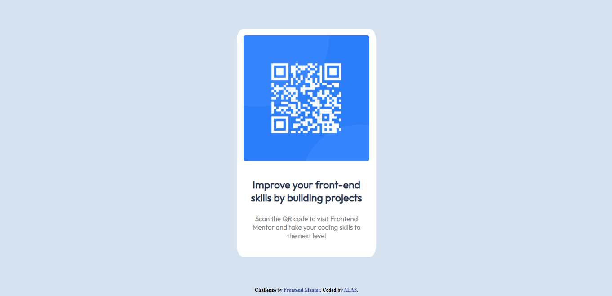

# Frontend Mentor - QR code component solution

This is a solution to the [QR code component challenge on Frontend Mentor](https://www.frontendmentor.io/challenges/qr-code-component-iux_sIO_H). Frontend Mentor challenges help you improve your coding skills by building realistic projects. 

## Table of contents

- [Overview](#overview)
  - [Screenshot](#screenshot)
  - [Links](#links)
- [My process](#my-process)
  - [Built with](#built-with)
  - [What I learned](#what-i-learned)
  - [Useful resources](#useful-resources)
- [Author](#author)

## Overview

### Screenshot

### Links

- Live Site URL:[https://your-live-site-url.com](https://alas08.github.io/qr-code.github.io/

## My process

### Built with

- HTML5 
- CSS custom properties

### What I learned

It's my first real project and I'll admit that even though the design looks simple, I have a hard time creating it using html and css. But as a beginner, It makes me happy that I've been able to create it, although it's not that perfect but this is my first time and I'm sure that I'll improve as I keep learning.

### Useful resources

- (https://www.w3schools.com/) - This helped me for codes and terms I'm not familiar. I'll keep going back to it when I don't understand something about my code.

## Author

- Frontend Mentor - [@ALAS08](https://www.frontendmentor.io/profile/ALAS08)

